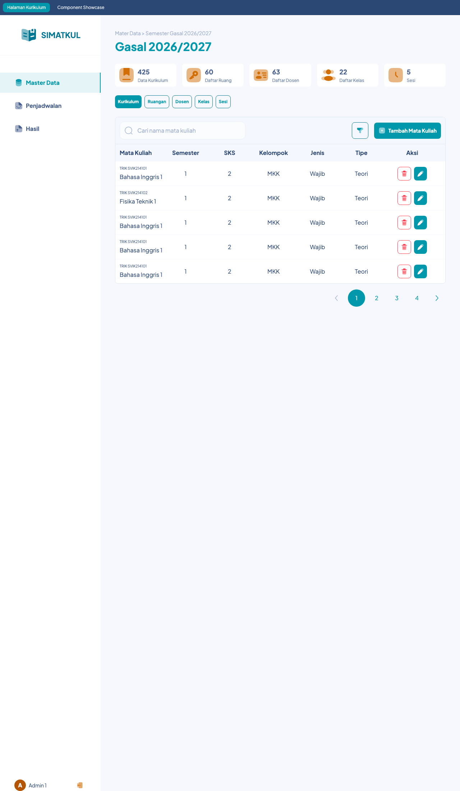
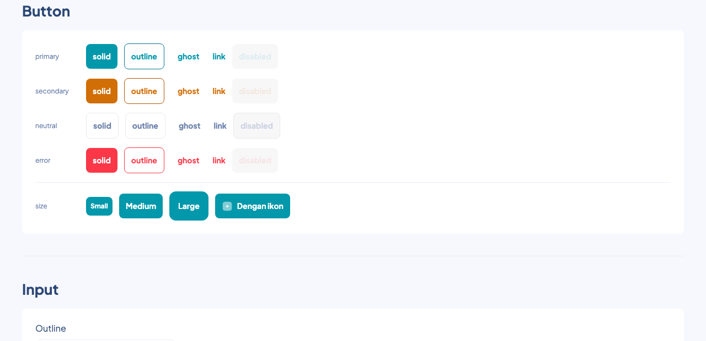
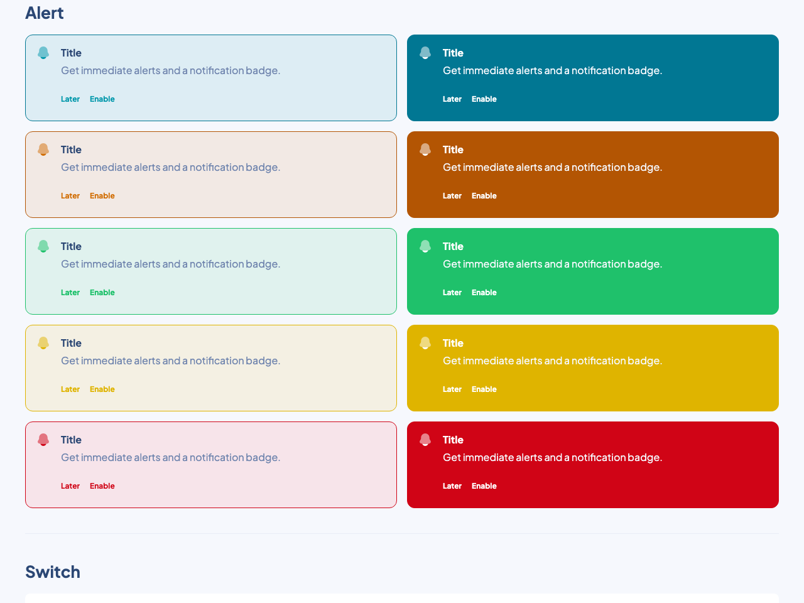
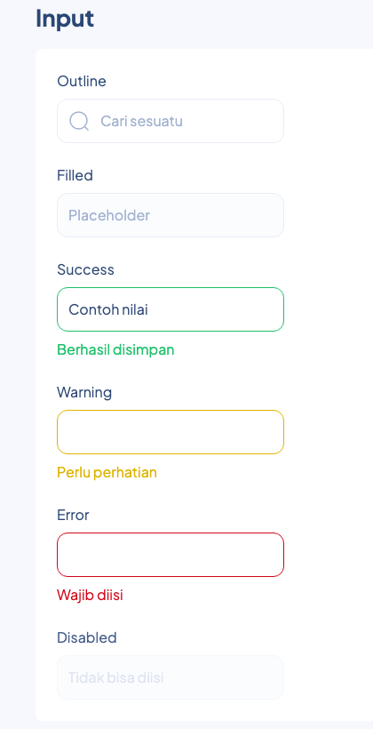
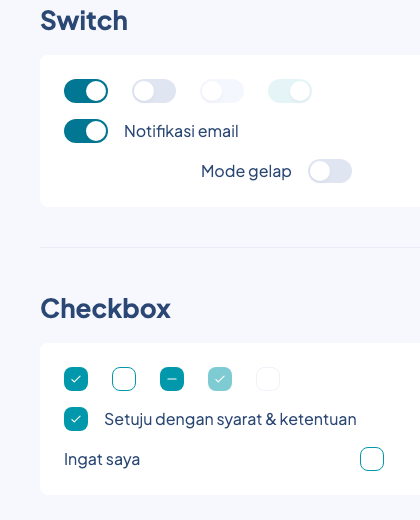
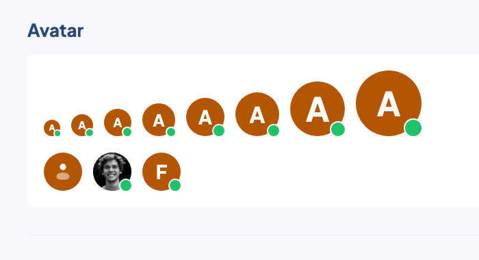
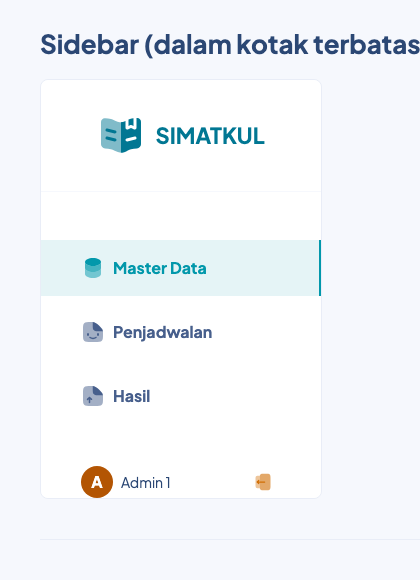
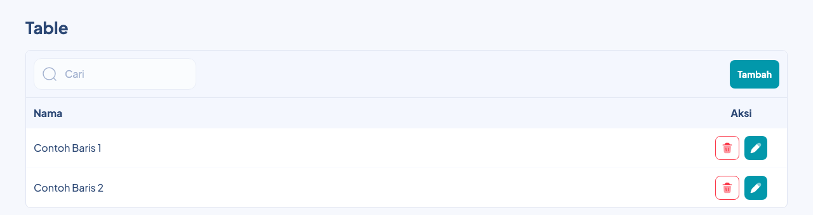
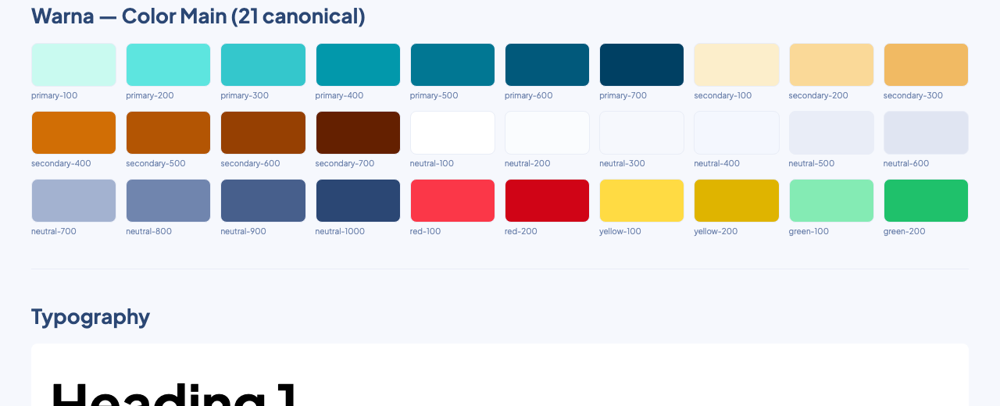
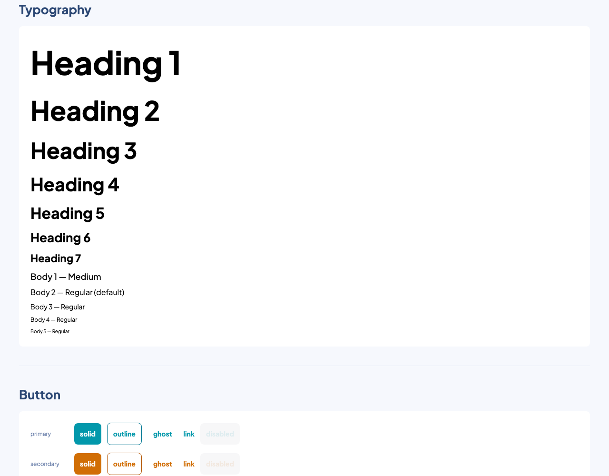

# SIMATKUL Design System

Component library React untuk aplikasi SIMATKUL, dibangun langsung dari design
system Figma resmi ("SIMATKUL — UI Workspace"). Styling pakai Tailwind CSS v4
secara internal, tapi **dikompilasi habis ke satu file CSS mandiri** — lihat
[Apakah saya wajib install Tailwind?](#apakah-saya-wajib-install-tailwind) di
bawah sebelum bingung soal ini.

Dokumen ini ditulis supaya bisa langsung dipahami baik oleh manusia maupun
asisten AI (Claude, Copilot, dll.) yang membantu meng-install/pakai package
ini — kalau kamu asisten AI yang sedang membaca ini untuk membantu seseorang
integrasi package ini, bagian [Troubleshooting](#troubleshooting) dan
[Batasan yang Diketahui](#batasan-yang-diketahui-known-limitations) di bawah
berisi jawaban untuk pertanyaan yang paling sering muncul.


<p align="center"><sub>Halaman nyata di repo ini (<code>src/pages/Kurikulum.tsx</code>) — Sidebar, StatCard, Button, Input, Table, dan Pagination semua dari package ini, bukan mockup.</sub></p>

---

## Daftar Isi

- [Prasyarat](#prasyarat)
- [Instalasi](#instalasi)
- [Quick Start](#quick-start)
- [Apakah saya wajib install Tailwind?](#apakah-saya-wajib-install-tailwind)
- [Katalog Komponen](#katalog-komponen)
- [Design Tokens](#design-tokens)
- [Ikon (Solar Icons)](#ikon-solar-icons)
- [Kustomisasi / Theming](#kustomisasi--theming)
- [Update ke Versi Terbaru](#update-ke-versi-terbaru)
- [Troubleshooting](#troubleshooting)
- [Batasan yang Diketahui (Known Limitations)](#batasan-yang-diketahui-known-limitations)
- [Development Lokal (di repo ini)](#development-lokal-di-repo-ini)
- [Struktur Proyek](#struktur-proyek)
- [Keputusan Arsitektur (untuk yang penasaran/AI)](#keputusan-arsitektur-untuk-yang-penasaranai)

---

## Prasyarat

- **React 18 atau lebih baru**, plus `react-dom` versi yang sama. Ini
  `peerDependencies` — TIDAK ikut ter-install otomatis, project kamu harus
  sudah punya sendiri.
- Node.js 18+ untuk proses install (karena ada build step lewat `prepare`,
  lihat di bawah).
- **Tailwind CSS di project kamu sendiri TIDAK wajib** — baca penjelasan di
  [bagian ini](#apakah-saya-wajib-install-tailwind).

## Instalasi

Package ini didistribusikan lewat Git (belum lewat npm registry), karena
masih sering di-update:

```bash
npm install github:safwanpiliang/ASSETS-Design-system
```

Ini akan otomatis ambil branch `main` (versi terbaru). Kalau mau pin ke versi
yang tidak berubah-ubah, pakai tag tertentu:

```bash
npm install github:safwanpiliang/ASSETS-Design-system#v0.1.0
```

**Apa yang terjadi di balik layar saat `npm install`:** karena ini install
dari Git (bukan tarball npm registry siap pakai), npm akan clone repo ini,
install seluruh dependency (termasuk devDependencies), lalu otomatis
menjalankan script `prepare` yang meng-compile source `src/` jadi `dist/`.
Kalau proses ini gagal, lihat [Troubleshooting](#troubleshooting).

## Quick Start

```tsx
// main.tsx / entry point aplikasi kamu — import CSS-nya SEKALI SAJA, di sini
import 'simatkul-design-system/style.css'
```

```tsx
import { Button, Input, Table, type TableColumn } from 'simatkul-design-system'

function ContohForm() {
  return (
    <div className="flex flex-col gap-4">
      <Input label="Nama" placeholder="Masukkan nama" />
      <Button theme="primary" variant="solid">
        Simpan
      </Button>
    </div>
  )
}
```

> **Perhatikan:** prop untuk gaya visual Button namanya **`variant`**, bukan
> `type` — `type` di `Button` adalah atribut native HTML (`submit`/`reset`/
> `button`), disengaja dipisah supaya tidak bentrok (lihat
> [Keputusan Arsitektur](#keputusan-arsitektur-untuk-yang-penasaranai)).

## Apakah saya wajib install Tailwind?

**Tidak, untuk sekadar memakai komponennya.** `dist/style.css` yang di-import
di atas bukan cuma berisi token warna — itu adalah **hasil compile penuh
Tailwind CSS** (base reset + seluruh utility class yang benar-benar dipakai
komponen di package ini), jadi sudah mandiri/self-contained. Komponen akan
tampil benar walau project kamu sama sekali tidak pakai Tailwind.

**Tapi** ada dua situasi di mana kamu tetap perlu Tailwind v4 di project
kamu sendiri:

1. Kamu mau pakai **token warna/tipografi yang sama** (mis. `bg-primary-400`,
   `text-b2`) di komponen buatanmu sendiri, di luar package ini. Saat ini
   package ini **tidak mengekspor file token mentah terpisah** (cuma
   `style.css` yang sudah final) — kamu perlu menyalin definisi `@theme` dari
   `src/styles/tokens.css` di repo ini secara manual kalau mau itu (lihat
   [Batasan yang Diketahui](#batasan-yang-diketahui-known-limitations)).
2. Import `dist/style.css` ini bersifat **global** — dia menyertakan CSS
   reset Tailwind (`box-sizing: border-box`, dsb. di elemen `*`). Kalau
   project kamu juga punya Tailwind sendiri dengan reset yang beda, biasanya
   tidak masalah (reset Tailwind idempotent), tapi worth diketahui.

## Katalog Komponen

Semua diimpor dari `'simatkul-design-system'` (named export).

| Komponen | Ringkas |
|---|---|
| `Button` | `theme` (primary/secondary/neutral/error) × `variant` (solid/outline/ghost/link) × `size` (sm/md/lg). `iconLeft`/`iconRight` terima `ReactNode` apa saja. |
| `Input` | Text field. `variant` (outline/filled), `status` (default/success/warning/error), `label`, `helperText`, `leftIcon`/`rightIcon`. |
| `Text` | Elemen tipografi (`variant`: h1–h7, b1–b5), otomatis pakai tag HTML semantik yang sesuai (`h1`–`h6`, `p`) kecuali di-override lewat `as`. |
| `Alert` | Banner notifikasi. `variant` (outline/filled) × `status` (default/secondary/success/warning/error). `icon`, `title`, `description`, `actions` (kirim `<Button variant="link">` sendiri). |
| `Switch` / `SwitchField` | Toggle on/off. `SwitchField` menambah label + `textSide` (left/right). Standalone terkontrol (`checked`/`onCheckedChange`), bukan native `<input>`. |
| `Checkbox` / `CheckboxField` | Sama pola dengan Switch, plus `indeterminate`. |
| `Radio` / `RadioField` | Sama pola dengan Checkbox. **Tidak ada `RadioGroup`** — pemilihan tunggal diatur pemanggil sendiri lewat satu state `value` (lihat contoh di [Katalog](#-radio-tanpa-radiogroup) atau `src/pages/Showcase.tsx`). |
| `Dropdown` | Select multi-pilihan dengan trigger berupa `Input` (readOnly) + panel `Checkbox`, posisi otomatis (auto-flip/shift) pakai Floating UI. |
| `Stepper` | Dua tombol (kurang/tambah) murni — **tidak menampilkan angka sendiri**, nilai dikelola pemanggil. |
| `Tooltip` | Bubble info. Mode hover otomatis (tanpa prop `open`) atau terkontrol (`open` diisi eksplisit, untuk tips onboarding). Auto-flip/shift/portal via Floating UI. |
| `Avatar` | 8 ukuran (`tiny`…`xxxl`). Otomatis fallback: `src` foto gagal/kosong → `icon` → huruf inisial. `status` = titik hijau online. |
| `StatCard` | Kartu statistik kecil (ikon + angka + label). |
| `Table` | Data-driven: `columns` (dengan `render` per kolom untuk sel custom), `data`, `rowKey`. Opsional `toolbar`. |
| `Pagination` | `page`, `totalPages`, `onPageChange`. ⚠️ belum ada pola ellipsis untuk puluhan halaman — lihat [Batasan](#batasan-yang-diketahui-known-limitations). |
| `Sidebar` | Nav aplikasi, fill-height otomatis di parent flex. `items` (data-driven), `logo` (slot penuh, WAJIB diisi ulang kalau dipakai project lain), `activeColor` (override warna aktif tanpa fork token). |
| `Modal` | Dialog generik: `title`+`description`+`children` bebas+`actions`, `buttonLayout` (horizontal/vertical). Tutup lewat Escape/klik-luar/tombol aksi — tidak ada tombol X. |

Screenshot di bawah diambil langsung dari halaman **Component Showcase**
(`src/pages/Showcase.tsx`, jalankan `npm run dev` untuk buka sendiri) —
render sungguhan, bukan mockup Figma:

<table>
<tr>
<td width="50%">

**Button** — 4 theme × 4 variant × 3 ukuran



</td>
<td width="50%">

**Alert** — outline & filled × 5 status



</td>
</tr>
<tr>
<td width="50%">

**Input** — semua status (default/success/warning/error/disabled)



</td>
<td width="50%">

**Switch & Checkbox**



</td>
</tr>
<tr>
<td width="50%">

**Avatar** — 8 ukuran + fallback foto/ikon/inisial + status dot



</td>
<td width="50%">

**Sidebar** — nav item, active state, avatar user, tombol logout



</td>
</tr>
</table>

**Table** — toolbar + kolom custom (`render`) + aksi per baris



### Contoh: Radio tanpa RadioGroup

```tsx
const [value, setValue] = useState('gasal')

<RadioField label="Semester Gasal" checked={value === 'gasal'} onCheckedChange={() => setValue('gasal')} />
<RadioField label="Semester Genap" checked={value === 'genap'} onCheckedChange={() => setValue('genap')} />
```

### Contoh: Table dengan kolom custom

```tsx
const columns: TableColumn<MataKuliah>[] = [
  { key: 'name', header: 'Mata Kuliah' }, // default: tampilkan row[key] apa adanya
  { key: 'semester', header: 'Semester', align: 'center' },
  {
    key: 'aksi',
    header: 'Aksi',
    align: 'center',
    width: '160px',
    render: (row) => <Button theme="primary" variant="solid" size="sm" onClick={() => edit(row.id)} />,
  },
]

<Table columns={columns} data={rows} rowKey={(r) => r.id} />
```

## Design Tokens

Semua nilai di bawah sumbernya Figma Variables asli (`Color Main`,
`Typography`, `light.tokens.json`) — bukan tebakan. Dipakai internal oleh
komponen; kamu **tidak perlu** menuliskannya manual kecuali membuat komponen
baru sendiri di luar package ini.

### Warna (21 warna kanonik)

| Keluarga | 100 | 200 | 300 | 400 | 500 | 600 | 700 | 800 | 900 | 1000 |
|---|---|---|---|---|---|---|---|---|---|---|
| `primary` | `#C9FAF0` | `#5DE5DF` | `#34C7CC` | `#0298AB` | `#017793` | `#01597B` | `#004063` | — | — | — |
| `secondary` | `#FCEECB` | `#FAD998` | `#F1BA63` | `#D16E05` | `#B35503` | `#964002` | `#642000` | — | — | — |
| `neutral` | `#FFFFFF` | `#FAFCFE` | `#F6F8FD` | `#F4F7FE` | `#E9EDF7` | `#E0E5F2` | `#A3B2D0` | `#7085AE` | `#475F8C` | `#2B4774` |
| `red` | `#FB3748` | `#D00416` | | | | | | | | |
| `yellow` | `#FFDB43` | `#DFB400` | | | | | | | | |
| `green` | `#84EBB4` | `#1FC16B` | | | | | | | | |



Aturan penting: **jangan pernah pakai warna hex di luar tabel ini** untuk
komponen baru — itu aturan tetap dari pemilik design system ini. Kalau
Figma menunjukkan warna yang tidak ada di sini, itu kemungkinan besar sisa
template lama (lihat [Batasan](#batasan-yang-diketahui-known-limitations)) —
ganti dengan warna terdekat dari tabel, jangan ditambahkan sebagai warna baru.

### Tipografi

Satu font: **Plus Jakarta Sans**. Semua Heading = Bold, rasio line-height
selalu 1.5× ukuran font.

| Token | Ukuran | Line-height | Weight |
|---|---|---|---|
| `h1` | 68px | 102px | Bold |
| `h2` | 56px | 84px | Bold |
| `h3` | 46px | 69px | Bold |
| `h4` | 38px | 57px | Bold |
| `h5` | 32px | 48px | Bold |
| `h6` | 26px | 39px | Bold |
| `h7` | 22px | 33px | Bold |
| `b1` | 18px | 27px | Medium |
| `b2` | 16px | 24px | Regular |
| `b3` | 14px | 21px | Regular |
| `b4` | 12px | 18px | Regular |
| `b5` | 10px | 15px | Regular |



### Radius, Shadow, Spacing

- **Radius**: `1`=4px, `2`=8px, `3`=12px, `4`=16px, `5`=20px, `6`=24px,
  `7`=32px, `none`=0, `full`=999px (class Tailwind: `rounded-1`…`rounded-7`).
- **Shadow**: `e0` (flat) → `e3` (elevasi tinggi, dipakai Modal/Dropdown
  panel). Class: `shadow-e0`…`shadow-e3`.
- **Spacing & Stroke**: sengaja **tidak** jadi class Tailwind kustom (akan
  menimpa skala spacing bawaan Tailwind secara diam-diam) — dipetakan ke
  utility Tailwind standar (`p-2`, `border-2`, dst). Detail lengkap ada di
  komentar `vite.lib.config.ts`/kode sumber token.

## Ikon (Solar Icons)

Semua ikon dari [`@solar-icons/react`](https://www.npmjs.com/package/@solar-icons/react)
(dependency package ini, otomatis ter-install). Kalau kamu mau menyisipkan
ikon sendiri ke prop seperti `Button`'s `iconLeft` atau `Table` column
`render`:

```tsx
import Pen from '@solar-icons/react/messages/Pen'

<Button iconLeft={<Pen weight="BoldDuotone" />}>Edit</Button>
```

**Cara import-nya per KATEGORI, bukan per gaya** —
`@solar-icons/react/<kategori>/<NamaIkon>`, lalu gaya (Bold Duotone/Line
Duotone/dst) dipilih lewat prop `weight`, BUKAN lewat nama file berbeda.
Kalau tidak tahu kategori suatu ikon:

```bash
find node_modules/@solar-icons/react/dist/esm/csr -iname "NamaIkon.mjs"
```

Konvensi yang dipakai di seluruh package ini: **Bold Duotone** untuk ikon
konten/makna (ikon di dalam field, kartu, menu), **Line Duotone** untuk ikon
UI/affordance (chevron, panah, kaca pembesar).

## Kustomisasi / Theming

Kebanyakan komponen otomatis ikut token di atas dan tidak perlu dikustom.
Satu pengecualian: `Sidebar`, yang dirancang untuk dipakai ulang di project
lain dengan branding beda:

```tsx
<Sidebar
  items={menuItems}
  activeColor="#7C3AED" // override warna aksen menu aktif, tanpa fork token
  logo={<MyCompanyLogo />} // ganti logo SIMATKUL dengan punya sendiri
/>
```

`activeColor` bekerja lewat CSS variable dengan fallback
(`var(--sb-active, var(--color-primary-400))`) — kalau tidak diisi, otomatis
pakai token `primary-400` bawaan.

## Update ke Versi Terbaru

```bash
npm update simatkul-design-system
```

Ini cuma benar-benar menarik versi baru kalau `package.json` kamu merujuk ke
branch (`#main`), bukan tag/commit tertentu. Kalau di-pin ke tag, harus ganti
manual nomor tag-nya lalu `npm install` ulang.

## Troubleshooting

**Komponen tampil polos/tidak ada styling sama sekali**
→ Lupa `import 'simatkul-design-system/style.css'` di entry point aplikasi.
Harus diimpor tepat satu kali, di file paling atas (mis. `main.tsx`).

**Ikon tidak muncul / kosong**
→ Kalau ikon dikirim lewat prop (`iconLeft`, dsb.) dan hasilnya kosong,
biasanya salah cara import `@solar-icons/react` — lihat
[bagian Ikon](#ikon-solar-icons) di atas. Kalau ikon muncul tapi ukurannya
kecil/tidak proporsional, pastikan wrapper ikon custom kamu punya class
`[&>svg]:size-full` (pola yang dipakai semua komponen di package ini).

**`npm install` gagal / error saat proses install**
→ Karena ini git dependency, `npm install` menjalankan build (`prepare`)
begitu clone selesai. Kalau gagal, coba jalankan manual untuk lihat pesan
errornya:
```bash
cd node_modules/simatkul-design-system && npm run build
```
Penyebab paling umum: versi Node.js terlalu lama (butuh 18+), atau cache
`node_modules/.vite` di dalam package basi — hapus `node_modules/.vite` di
dalam folder package tersebut lalu install ulang.

**Error `Cannot read properties of null (reading 'useContext')` atau
"Invalid hook call"**
→ Tanda klasik ada **dua copy React** ter-load bersamaan. Karena `react`/
`react-dom` sudah didaftarkan sebagai `peerDependencies` (bukan
`dependencies`), ini seharusnya tidak terjadi di setup normal — tapi kalau
project kamu pakai monorepo/workspace dengan hoisting yang aneh, cek dengan
`npm ls react` dan pastikan cuma ada satu versi.

**TypeScript: `Cannot find module 'simatkul-design-system'`**
→ Cek `node_modules/simatkul-design-system/dist/` benar-benar ada isinya
(`index.mjs`, `index.d.ts`, dst). Kalau kosong, `prepare` gagal jalan diam-
diam — lihat poin "npm install gagal" di atas.

**Class Tailwind sendiri (`bg-primary-400`, dst.) tidak ke-apply di
komponen buatan sendiri (bukan dari package ini)**
→ Sudah diperkirakan, bukan bug — lihat [bagian ini](#apakah-saya-wajib-install-tailwind)
poin 1.

**Dropdown/Tooltip/Modal terpotong atau posisinya salah**
→ Ketiganya pakai `FloatingPortal` (Floating UI) yang render ke
`document.body`, jadi seharusnya tidak ke-clip oleh `overflow:hidden` parent
manapun. Kalau tetap ada masalah posisi, biasanya soal `z-index` — elemen
ini pakai `z-50`; cek tidak ada elemen lain di app kamu dengan z-index lebih
tinggi yang menutupinya secara visual.

**Prop `type` di Button tidak dikenali / TypeScript error soal `type`**
→ Prop untuk gaya visual Button namanya `variant`, bukan `type`. `type` di
Button itu atribut native HTML button (`submit`/`reset`/`button`). Ini
perubahan yang disengaja (lihat [Keputusan Arsitektur](#keputusan-arsitektur-untuk-yang-penasaranai)).

## Batasan yang Diketahui (Known Limitations)

Hal-hal yang secara sadar BELUM diimplementasikan atau punya asumsi yang
belum diverifikasi 100% ke desainer — dicatat di sini supaya tidak dikira
bug tersembunyi:

- **`Pagination`** menampilkan SEMUA nomor halaman tanpa pola ellipsis untuk
  daftar puluhan halaman — Figma cuma menyediakan contoh 4 halaman.
- **`Table`** tidak punya pagination bawaan (dipasang terpisah di sebelahnya)
  dan belum punya desain state kosong resmi dari Figma.
- **Tidak ada token/CSS terpisah untuk warna Grey (`#E5E7EA`)** yang sempat
  muncul di beberapa komponen Figma (Stepper outline, dll.) — itu di luar 21
  warna kanonik, jadi selalu diganti ke warna terdekat (`Neutral/600`) alih-
  alih ditambahkan sebagai token baru.
- **Status `Info` (warna biru) dihapus dari `Input`** atas keputusan pemilik
  design system — jangan tambahkan lagi kecuali diminta eksplisit.
- Beberapa komponen (Input, Toggle/Switch, Avatar, Checkbox, Radio, Dropdown
  item) awalnya punya label berfont **Inter** di Figma — ini sisa template
  scaffold lama, SELALU dikoreksi ke Plus Jakarta Sans (`text-b2`, dst) di
  kode, bukan direplikasi.
- **Tidak ada `RadioGroup`** (lihat [Katalog Komponen](#katalog-komponen)) —
  keputusan desain, bukan kelalaian.

## Development Lokal (di repo ini)

```bash
npm install
npm run dev     # buka preview: halaman "Kurikulum" (contoh nyata) + "Component Showcase" (semua komponen)
npm run build   # build library ke dist/ (otomatis jalan lewat "prepare" saat konsumen install dari Git)
```

`npm run dev` memakai `vite.config.ts` (app biasa). `npm run build` memakai
`vite.lib.config.ts` (Library Mode) — dua config terpisah supaya halaman
preview (`src/pages/`) tidak pernah ikut ke-bundle ke package yang
di-install konsumen.

## Struktur Proyek

```
src/
├── components/       # satu folder per komponen (Button/, Input/, Table/, dst)
├── lib/cn.ts         # helper gabung className (clsx + tailwind-merge)
├── pages/            # preview lokal saja — TIDAK diekspor (Kurikulum.tsx, Showcase.tsx)
├── styles/
│   ├── tokens.css    # definisi @theme Tailwind v4 (warna/font/radius/shadow)
│   └── index.css     # @import "tailwindcss" + tokens.css
└── index.ts          # ENTRY POINT package — cuma ini yang diekspor ke konsumen
```

## Keputusan Arsitektur (untuk yang penasaran/AI)

Beberapa pilihan desain API yang mungkin terlihat tidak biasa — dicatat
alasannya supaya tidak dikira sembarangan:

- **Prop `variant` di `Button` (bukan `type`)**: awalnya memang `type`, tapi
  bentrok dengan atribut native `<button type="submit">` saat generate
  TypeScript declaration file (`vite-plugin-dts` melempar error). Di-rename
  jadi `variant` sekaligus menyamakan dengan `Input`/`Alert` yang sudah
  pakai nama itu.
- **`Switch`/`Checkbox`/`Radio` bukan `<input type="checkbox">` native**,
  tapi `<button role="...">` custom yang dikontrol lewat `checked`/
  `onCheckedChange`. Konsisten di seluruh package, dan cocok dengan visual
  Figma yang butuh kontrol penuh atas transisi/animasi.
- **Tidak ada Context/Provider di mana pun** (termasuk untuk `Radio` — tidak
  ada `RadioGroup`) — semua komponen murni terkontrol lewat props eksplisit.
  Pola ini dipertahankan konsisten supaya API tetap dangkal & predictable.
- **`Sidebar` tanpa `h-full`, pakai `self-stretch`**: `h-full` butuh parent
  dengan height eksplisit untuk resolve; kalau parent cuma `min-h-screen`
  (umum di layout app), `h-full` gagal diam-diam dan Sidebar cuma setinggi
  isinya. `self-stretch` memanfaatkan `align-items: stretch` bawaan flexbox,
  yang tetap bekerja dengan `min-height`.
- **`Tooltip`/`Dropdown`/`Modal` pakai `@floating-ui/react`**, bukan CSS
  posisi manual — supaya dapat auto-flip/shift saat kehabisan ruang di
  viewport, plus portal ke `document.body` supaya tidak ke-clip parent
  manapun. Semua komponen "floating" baru sebaiknya pakai library yang sama
  supaya tidak ada dua sistem positioning berbeda.
- **Warna hasil ekstraksi Figma yang tidak ada di 21 warna kanonik selalu
  diganti ke warna terdekat**, bukan ditambahkan sebagai token baru —
  aturan eksplisit dari pemilik design system (lihat
  [Batasan yang Diketahui](#batasan-yang-diketahui-known-limitations)).
